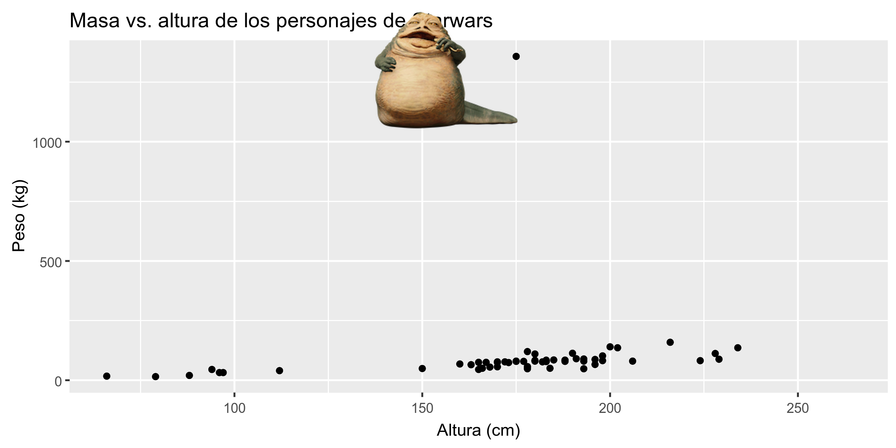

```{r child = "../setup.Rmd"}
```

```{r packages, echo=FALSE, message=FALSE, warning=FALSE}
library(emo)
library(tidyverse)
library(fontawesome)
library(magick)
```

class: center, middle

# Analisis Exploratorio de Datos (EDA)

---

## Que es EDA?

- Analisis exploratorio de datos (EDA) es un acercamiento a analizar conjuntos de datos que se enfoca en resumir sus principales caracteristicas.
- Usualmente, esto es visual. En eso nos enfocaremos hoy.
- Pero también podríamos calcular estadísticas de tendencia central y realizar manipulaciones/transformaciones de los datos en (o antes) de esta etapa del
análisis. En eso nos centraremos a continuación.

---

class: center, middle

# Visualizacion de Datos

---

## Visualizacion de Datos

> *"La gráfica simple ha traído más información a la mente del analista de datos que cualquier otro dispositivo." — John Tukey*

- La visualización de datos es la creación y el estudio de la representación visual de datos.
- Hay muchas herramientas para visualizar datos (R es una de ellas), y muchos enfoques / sistemas dentro de R para hacer visualizaciones de datos (** ggplot2 ** es una de ellas, y eso es lo que vamos a usar).

---

## ggplot2 $\in$ tidyverse

.pull-left[

]
.pull-right[
- **ggplot2** es un paquete de visualizacion de datos parte del tidyverse.
- La `gg` en "ggplot2" significa Grammar of Graphics
- Esta inspirado en el libro **Grammar of Graphics** por Leland Wilkinson <sup>†</sup>
- Una gramatica de graficos es una herramienta que nos permite describir de manera concisa los componentes de una grafica.


]

.footnote[ 
<sup>†</sup> Fuente: [BloggoType](http://bloggotype.blogspot.com/2016/08/holiday-notes2-grammar-of-graphics.html)
]

---

.question[
¿Cuáles son las funciones haciendo el trazado? ¿Cuál es el conjunto de datos que se está trazando?
¿Qué variable está en el eje de x y qué variable está en el eje de y? Que significa la advertencia?
]

```{r fig.width = 6, fig.height=2.75}
ggplot(data = starwars, mapping = aes(x = height, y = mass)) +
  geom_point() + #<<
  labs(title = "Masa vs Altura de personajes de Starwars",
       x = "Altura (cm)", y = "Peso (kg)")
```

---

.question[
Que hace `geom_smooth()`? Que mas ha cambiado entre la grafica anterior y esta?
]

```{r fig.width = 6, fig.height=3, warning=FALSE, message=FALSE}
ggplot(data = starwars, mapping = aes(x = height, y = mass)) +
  geom_point() +
  geom_smooth() + #<<
  labs(title = "Masa vs Altura de personajes de Starwars",
       x = "Altura (cm)", y = "Peso (kg)")
```

---

## Hola ggplot2!

- `ggplot()` es la funcion principal en ggplot2 y las graficas se construyen en capas.
- La estructura del codigo para las graficas se puede resumir muchas veces como

```{r eval = FALSE}
ggplot + 
  geom_xxx
```

o, de forma mas precisa
.small[
```{r eval = FALSE}
ggplot(data = [dataset], mapping = aes(x = [x-variable], y = [y-variable])) +
   geom_xxx() +
   otras_opciones
```
]
- Para usar funciones de `ggplot2`, primero sube el `tidyverse`
```{r}
library(tidyverse)
```
- Para ayuda con ggplot2, mirar [ggplot2.tidyverse.org](http://ggplot2.tidyverse.org)

---

class: center, middle

# Visualizando Star Wars

---

## Terminologia de Dataset

.question[
¿Qué representa cada fila? ¿Qué representa cada columna?
]

.small[
```{r message=FALSE}
starwars
```
]

--

- Cada fila es una ** observación **
- Cada columna es una ** variable **

---

## Luke Skywalker


---

## ¿Qué hay en los datos de Star Wars?

Vamos a ver los datos con la funcion `glimpse`:
```{r}
glimpse(starwars)
```

---

## ¿Qué hay en los datos de Star Wars?

.question[
¿Cuántas filas y columnas tiene este dataset? ¿Qué representa cada fila? ¿Qué representa cada columna?
]

Ejecute lo siguiente ** en la Consola ** para ver la ayuda
```{r eval = FALSE}
?starwars
```

```{r echo=FALSE}
knitr::include_graphics("img/starwars-help.png")
```

---

## Masa vs. altura

```{r fig.width = 6, fig.height=3}
ggplot(data = starwars, mapping = aes(x = height, y = mass)) +
  geom_point()
```

---

## ¿Qué es esa advertencia?

- No todos los personajes tienen información de altura y masa (por lo tanto, 28 de ellos no están trazados)

```
## Warning: Removed 28 rows containing missing values (geom_point).
```

- En adelante, suprimiré la advertencia para ahorrar espacio en las diapositivas, pero es importante tenerlo en cuenta

---

## Masa vs. altura

.question[
¿Cómo describirías esta relación? ¿Qué otras variables nos ayudarían a comprender los puntos de datos que no siguen la tendencia general? ¿Quién es el personaje no tan alto pero realmente gordo?
]

.small[
```{r fig.width = 6, fig.height=2.75, warning=FALSE}
ggplot(data = starwars, mapping = aes(x = height, y = mass)) +
  geom_point() +
  labs(title = "Masa vs. altura de los personajes de Starwars", #<<
       x = "Altura (cm)", y = "Peso (kg)")             #<<
```
]

---

## Jabba!

```{r echo=FALSE, warning=FALSE, cache=TRUE}
jabba <- image_read("img/jabba.png")

fig <- image_graph(width = 2400, height = 1200, res = 300)
ggplot(data = starwars, mapping = aes(x = height, y = mass)) +
  geom_point(size = 1.5) +
  labs(title = "Masa vs. altura de los personajes de Starwars", #<<
       x = "Altura (cm)", y = "Peso (kg)")
dev.off()

out <- fig %>% image_composite(jabba, offset = "+1000+30")

image_write(out, "img/jabbaplot.png", format = "png")

```

---

## Variables adicionales

We can map additional variables to various features of the plot:

Podemos asignar variables adicionales a varias características de la trama:

- estética
  - forma
  - color
  - tamaño
  - alpha (transparencia)
- facetting: pequeños paneles que muestran diferentes subconjuntos

---

class: center, middle

# Estética (Aesthetics)

---

## Opciones estéticas

Características visuales de trazar caracteres que pueden ** asignarse a una variable específica **
en los datos son

- color = `color`
- tamaño = `size`
- forma = `shape`
- transparencia = `alpha`

---

## Masa vs. altura + género

```{r fig.width = 7, fig.height=3.5, warning=FALSE}
ggplot(data = starwars, mapping = aes(x = height, y = mass, color = gender)) +
  geom_point()
```

---

## Masa vs. altura + género

Asignemos el tamaño a birth_year:

```{r fig.width = 7, fig.height=3.5, warning=FALSE}
ggplot(data = starwars, mapping = aes(x = height, y = mass, color = gender, 
                                      size = birth_year #<<
                                      )) +
  geom_point()
```

---

## Masa vs. altura + género

Aumentemos ahora el tamaño de todos los puntos ** no ** en función de los valores de una variable en los datos:

```{r fig.width = 7, fig.height=3.5, warning=FALSE}
ggplot(data = starwars, mapping = aes(x = height, y = mass, color = gender)) +
  geom_point(size = 2) #<<
```

---

## Resumen estética

- Las variables continuas se miden en una escala continua
- Las variables discretas se miden (o a menudo se cuentan) en una escala discreta

estética      | discreto                  | continuo
------------- | ------------------------- | ------------
color         | arcoiris de colores       | gradiente
tamaño        | pasos discretos           | mapeo lineal entre radio y valor
forma         | forma diferente para cada uno | no debería (y no funciona)

- Utilice la estética para mapear las características de una gráfica a una variable, defina las
características en el geom para modificaciones ** no ** asignadas a una variable

---

class: center, middle

# Faceting

---

## Opciones de Faceting

- Gráficas más pequeñas que muestran diferentes subconjuntos de datos
- Útil para explorar relaciones condicionales y datos de gran tamaño.

.small[
```{r fig.height=2.5, fig.width=6, warning=FALSE}
ggplot(data = starwars, mapping = aes(x = height, y = mass)) +
  facet_grid(. ~ gender) + #<<
  geom_point() +
  labs(title = "Masa vs. altura de personajes de Starwars",
       subtitle = "Faceted por genero",  #<<
       x = "Altura (cm)", y = "Masa (kg)")
```
]

---

## Exploremos más...

.question[
En las siguientes diapositivas describa lo que muestra cada gráfico. Pensar en
cómo se relaciona el código con el output.
]

--

<br><br><br>

.alert[
Las graficas en las siguientes diapositivas no tienen títulos, etiquetas de eje, etc. porque queremos que descubras lo que sucede en cada una. Pero tu siempre debe etiquetar tus graficas!
]

---

```{r fig.height=4, fig.width=6, warning=FALSE}
ggplot(data = starwars, mapping = aes(x = height, y = mass)) +
  geom_point() +
  facet_grid(gender ~ .)
```

---

```{r fig.width=7, warning=FALSE}
ggplot(data = starwars, mapping = aes(x = height, y = mass)) +
  geom_point() +
  facet_grid(. ~ gender)
```

---

```{r fig.height=4.5, fig.width=7, warning=FALSE}
ggplot(data = starwars, mapping = aes(x = height, y = mass)) +
  geom_point() +
  facet_wrap(~ eye_color)
```

---

## Resumen de Facetas

- `facet_grid()`: 
    - Grid en n2d
    - `filas ~ columnas`
    - usa `.` para no dividir
- `facet_wrap()`: cinta 1d envuelta en 2d

---

## <i class="fas fa-laptop"></i> `EA 03 - Starwars`

- Vaya a RStudio Cloud y haga una copia del proyecto de ejercicio de la aplicación y ejecútelo.
- Abrir y tejer el documento R Markdown

---

class: center, middle

# Identificando variables

---

## Número de variables involucradas

* Análisis de datos univariados: distribución de una sola variable
* Análisis de datos bivariados: relación entre dos variables
* Análisis de datos multivariados: relación entre muchas variables a la vez, generalmente centrada en la relación entre dos mientras se condiciona para otras

---

## Tipos de variables

- ** Las variables numéricas ** pueden clasificarse como ** continuas ** o ** discretas ** en función de si la variable puede tomar un número infinito de valores o solo números enteros no negativos, respectivamente.
- Si la variable es ** categórica **, podemos determinar si es ** ordinal ** en función de si los niveles tienen o no un orden natural.

---

class: center, middle

# Visualizando datos numéricos

---

## Describiendo formas de distribuciones numéricas

* forma:
  * sesgo: sesgado a la derecha, sesgado a la izquierda, simétrico (el sesgo está al lado de la cola más larga)
  * modalidad: unimodal, bimodal, multimodal, uniforme
* centro: media (`mean`), mediana (` median`), moda (no siempre útil)
* spread: rango (`rango`), desviación estándar (` sd`), rango intercuartil (`IQR`)
* observaciones inusuales

---

## Histogramas

.small[
```{r fig.width = 7, fig.height=4}
ggplot(data = starwars, mapping = aes(x = height)) +
  geom_histogram(binwidth = 10)
```
]

---

## Graficas de Densidad

.small[
```{r fig.width = 7, fig.height=4}
ggplot(data = starwars, mapping = aes(x = height)) +
  geom_density()
```
]

---

## Boxplots lado a lado

.small[
```{r fig.width = 7, fig.height=4}
ggplot(data = starwars, mapping = aes(y = height, x = gender)) +
  geom_boxplot()
```
]

---

class: center, middle

# Visualizando datos categoricos

---

## Graficas de barras

.small[
```{r fig.width = 7, fig.height=4}
ggplot(data = starwars, mapping = aes(x = gender)) +
  geom_bar()
```
]

---

## Graficas de barra segmentadas, conteos

.small[
```{r fig.width = 7, fig.height=4}
ggplot(data = starwars, mapping = aes(x = gender, fill = hair_color)) +
  geom_bar()
```
]

---

## Graficas de barra segmentadas, proporciones

.small[
```{r fig.width = 7, fig.height=4}
ggplot(data = starwars, mapping = aes(x = gender, fill = hair_color)) +
  geom_bar(position = "fill") +
  labs(y = "proportion")
```
]

---

## Que grafica de barra es mas apropiada?

.question[
¿Qué grafica de barras es una representación más útil para visualizar la relación entre género y color de pelo?
]

```{r}
starwars <- starwars %>%
  mutate(hair_color2 = fct_other(hair_color, 
                                 keep = c("black", "brown", "brown", "blond")))
```


```{r echo=FALSE, fig.height=1.4, fig.width=6}
ggplot(data = starwars, mapping = aes(x = gender, fill = hair_color2)) +
  geom_bar()
ggplot(data = starwars, mapping = aes(x = gender, fill = hair_color2)) +
  geom_bar(position = "fill") +
  labs(y = "proporcion")
```
